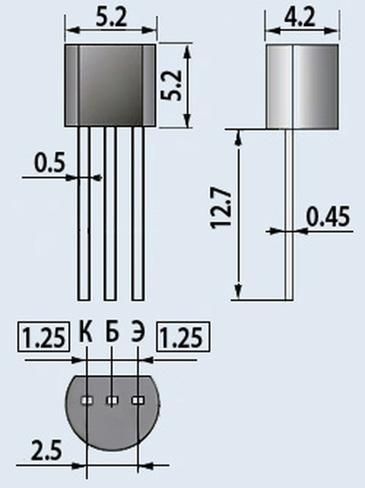

# Игра Арканоид для микроконтроллера Raspberry Pi Pico RP2040

## Инсталляция

## Электронные компоненты

## Схема устройства

## Документация

* Документация по Raspberry Pi Pico фреймворку Ардуино для Platformio https://arduino-pico.readthedocs.io/en/latest

## Инструменты

Преобразование пнг картинок в подходящий массив C для дисплея SH1106
https://notisrac.github.io/FileToCArray/

Необходимо включить режимы:
* Optimize for column read [x]
* 1bit line art
* unsigned char PROGMEM

Конвертер музыкальных файлов формата mod в массив С для проигрывания: https://github.com/moefh/mod-tools

Использование:

    mod2h input_music.mod output_file.h

Редактор пиксельной графики https://www.piskelapp.com/

## Структура программы

## Использованые библиотеки
